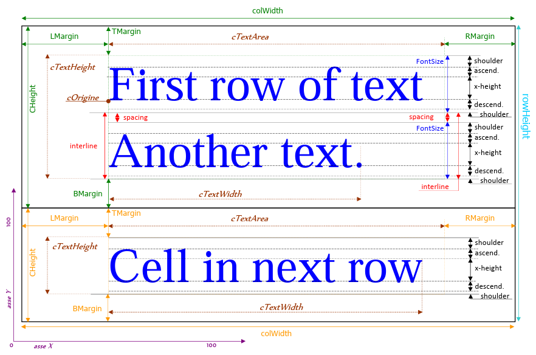

## Basic usage
1. Initialization
```
as_pdf.init;
```

2. Define page format
```
as_pdf.set_page_format('A4');
```

3. Define page orientation
```
as_pdf.set_page_orientation('P');
```

4. Define margins
```
as_pdf.set_margins(90, 10, 10, 10, 'mm');
```
Margins are defined in order Top, Left, Bottom, Right, and measure unit.
This margins are valid only for data table or body of document.

5. Define Header and Footer procedure
```
as_pdf.set_page_proc(varchar2 o clob);
```
(see above for procedure explanation)

6. Define columns formats (array or type as_pdf.tp_columns)

7. Define SQL code for query

8. Execute query2table or query2labels
(see above for parameter definition)

9. Optionally repeat from 6 with other query

10. Execute save_pdf o get_pdf for saving the file or get blob content.

## set_margins
It defines margins for data table, or for body of document.

The parameters are in order Top, Left, Bottom, Right, and measure unit.

Default values are: 3, 1, 4, 1, 'cm'.

## set_page_proc
It defines the code that will be executed at every page change.

This procedure accepts as parameter a varchar2 or a clob, that contains the code that will be executed dinamically as an execute immediate.

Each time the procedure is called, the code will be appended to an array, so you can define multiple blocks of code that will be executed in the same order that they were defined.

In the code you can use 3 substitution variables:
* `#PAGE_NR#`, that at runtime contains current page number,
* `#PAGE_COUNT#`, that at runtime contains the total number of pages,
* `§`, useful when you call procedures and functions that are defined in this package, this substitution variable will reduce the changes when you rename the package.

This procedure will be executed from finish_pdf, which in turn is executed by save_pdf or get_pdf, which are used respectively to save the PDF file or to obtain the blob with the content of the PDF document.

In other words just before saving, when we already know the total number of pages, it executes a loop for each page that invokes all blocks of code in the same order that they were defined.

There is no distinction between header and footer, it depends on the coordinates used in this procedure.

The margins defined with set_margins haven’t effect for this procedure.

## query2table
This procedure uses the result of a query to print a datagrid.

The parameters are:
Parameter | Description
--- | ---
query | is the query to execute       
formats | is an array of columns formats
colors | is an array of Hex RGB colors, for header and data table with odd/even evidentiation (can be a varchar2 list of comma separated Hex RGB colors)
hRowHeight | is forced header height, if null it’s calculated, if 0 the header isn’t drawn
tRowHeight | is forced record height, if null it’s calculated depending on contained data
um | is the measure unit used for specify heights and coordinates
startX | is the offset between the defined margin and the left border of the table
breakField | Check columns from 1 to BreakColumn for detect breakings, 0 test is disabled
interline | 
startY | is the offset between the defined margin and the top border of the table
frame | is border around format
bulk_size | 

## query2labels
This procedure uses the result of a query to print record into an array of labels, similar to a mailing list address.

The parameters are:
Parameter | Description
--- | ---
query | is the query to execute
formats | is an array of columns formats
colors | is an array of Hex RGB colors, for header and data table with odd/even evidentiation (can be a varchar2 list of comma separated Hex RGB colors)
hRowHeight | is forced header height, if null it’s calculated, if 0 the header isn’t drawn
tRowHeight | is forced record height, if null it’s calculated depending on contained data
um | is the measure unit used for specify heights and coordinates
startX | is the offset between the defined margin and the left border of the table
labelDef | is type defined record that contains label definition, each measure unit is in pt
interline | 
startY | is the offset between the defined margin and the top border of the table
frame | is border around format

The parameters for label definition are:
Parameter | Description
--- | ---
MaxColumns | is the number of label columns in a page
MaxRows | is the number of label rows in a page
Width | is the width of each label
Height | is the height of each label
hDistance | is the horizontal distance between right border and left border of two labels
vDistance | is the vertical distance between bottom border and top border of two labels

## Formatting parameters

The coordinate system of a PDF document is a cartesian plane with origin in the lower left corner of 
the sheet.

The measures are indicated with different colors:
* green for the first row cell,
* orange for the second row cell,
* light blue for the entire record,
* brown for the text,
* red, blue and black are used for the font

The package performs the calculations of dimensions in points (1 pt = 1/72 inch), but you can 
specify the parameters supplied to the package using the unit of measure defined with the parameter 
p_um.

Valid units of measure are: mm, cm, pt (or point), in (or inch), em (or pica, pc, p).

### Type tp_column
Record with column properties.

The fields for column definition are:

* The prefix col is relative to the entire column.

Field | Description
--- | ---
colLabel | Column Label
colWidth | Column width, measure unit is specified by p_um parameter
cellRow | Cell Row in Multirow Record. No missing rows are allowed. (0,1,2,3,...) or (1,2,3,...) not (0,2,3,...). Usually at every change of line you set offsetX = 0
offsetX | Force X position of cell, default is calculated from previous cell
offsetY | Force Y position of cell, default is calculated from previous cell. Indicates how many um moves down from top border of record row.

* The prefix h is relative to the header.
* The prefix t is relative to the table of data.

Header | Table | Description
--- | --- | ---
hFontName | tFontName | Font Name
hFontStyle | tFontStyle | Font Style (Bold/Italic/Normal)
hFontSize | tFontSize | Font Size in points
hFontColor | tFontColor | Font Color (ink) in RGB mode
hBackColor | tBackColor | Back Color (paper) in RGB mode
hLineColor | tLineColor | Line Color (border) in RGB mode
hLineSize | tLineSize | Line size (Thickness) of border. 0=no border
hBorder| tBorder | Side of border (4 bit: 1=Top, 2=Bottom, 4=Left, 8=Right)
hAlignment | tAlignment | Horizontal Alignment (L/C/R) (Left/Center/Right)
hAlignVert | tAlignVert | Vertical Alignment (T/C/B) (Top/Center/Bottom)
hTMargin | tTMargin | Top Margin of text into cell
hBMargin | tBMargin | Bottom Margin of text into cell
hLMargin | tLMargin | Left Margin of text into cell
hRMargin | tRMargin | Right Margin of text into cell
hCHeight | tCHeight | Cell Height
&nbsp; | tNumFormat | For Numeric and Date field indicates the format.<br>For CLOB field this string indicates image formatting parameters:<br>Example: 'W=-1,H=20mm,A=C,V=C'<br>W=width of picture, valid values are: -1=same proportion, 0=unchanged measure, Number+um=new width with um<br>H=height of picture, valid values are: -1=same proportion, 0=unchanged measure, Number+um=new height with um<br>A=Horizontal alignment (L,C,R)<br>V=Vertical alignment (T,M,B)<br>

* The prefix v is relative to variable parameters.

Field | Description
--- | ---
vSpacing | The spacing can be indicated in: pt (1 pt = 1/72 inch), % of FontSize or millimeters. Interline are calculated as vSpacing + FontSize
vInterline | Interline can be specified as vSpacing (pt/%/mm). If vInterline is specified vSpacing is ignored
hSpacing | Header Spacing (see vSpacing)
hInterline | Header Interline (see vInterline)

* The prefix c is relative to calculated parameters and are always in pt.

Field | Description
--- | ---
cSpacing | Is equal to vSpacing if specified, or cInterline-FontSize.
cInterline | Is column property equal to vInterline if specified or cSpacing (default=0) + FontSize.
cTextArea | Is column property that indicate maximum widht available for text and is equal to colWidth - tLeftMargin - tRightMargin
chSpacing | Header Spacing (see cSpacing)
chInterline | Header Interline (see cInterline)
chTextArea | Header TextArea (see cTextArea)
ctSpacing | Table Spacing (see cSpacing)
ctInterline | Table Interline (see cInterline)
ctTextArea | Table TextArea (see cTextArea)

### Type tp_columns
Table of tp_column records.

### Type tp_cell
Record with cell properties.

The fields for cell definition are:
Field | Description
--- | ---
cX | Left side (value is relative to Start_X)
cY | Top side (value is relative to current Y position)
cYbase | The basis of the row to which the cell belongs
cTextHeight | Is a cell property that indicates overall text height and is equal to cInterline * cRowsCount - cSpacing
cRowsCount | Number of Text rows
cTy | Distance between top border and the first text row
cWidth | Cell Width (pt)
cHeight | Cell Height (pt)
cRowText | Array with Text of each row
cRowTextX | Array with start point relative to left border, of each text row
cRowTextY | Array with start point relative to top border, of each text row
cRowTextWidth | Array with the width of each text row

During elaboration, this array is populated with single cell data.

The content of each cell is analyzed, if it’s numeric or date type, it’s formatted using tNumFormat, otherwise use wrapping for divide too long text rows.

### Type tp_cells
Table of tp_cell with row cells.